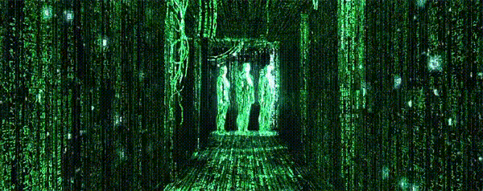

<h1 align="center">Eshaan Vimal - Software Developer</h1>

###

<h2>Chat</h2>

  
  

###

###

<h2>Stats</h2>

  
  <a href="#">

</a>

###

<h2>Tech</h2>

  
  
  
  
  
  
  
  
  
  
  
  
  
  
  
  
  
  
  
  
  
  
  
  
  
  
  
  
  
  
  
  
  
  
  
  
  
  
  
  
  
  
  
  
  
  
  
  
  
  
  
  
  
  
  

###

 

###